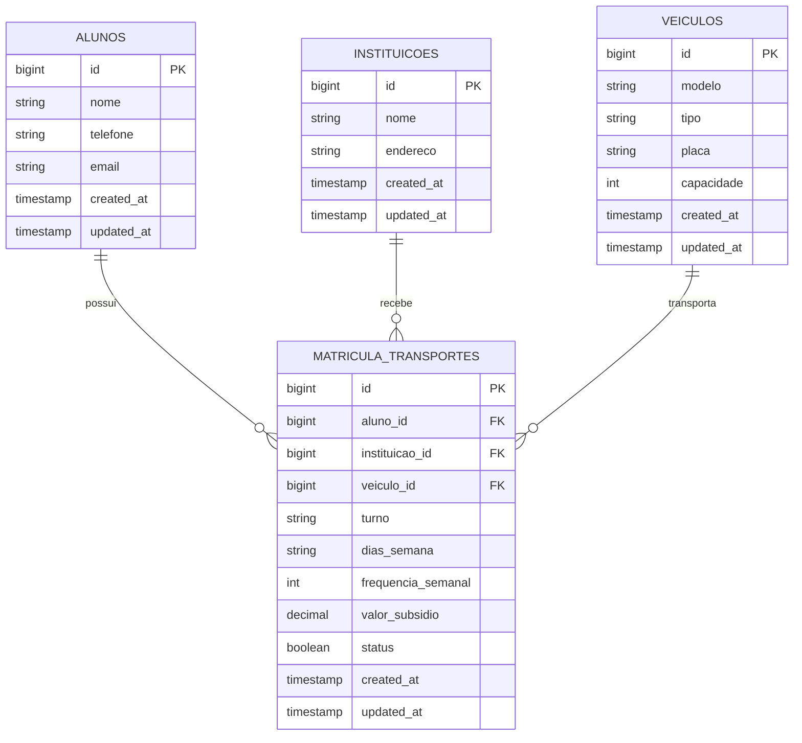

#  Nunes Tur

Sistema de gestão de transporte escolar municipal, desenvolvido em Laravel. Permite controlar alunos, instituições de ensino, veículos da frota e matrículas de transporte, além de gerar relatórios em PDF com os valores de subsídio para envio à prefeitura.

## Objetivo do projeto

O sistema foi desenvolvido com o intuito de digitalizar o controle de transporte escolar de uma cidade, substituindo planilhas manuais. O foco principal é permitir o cadastro de alunos, veículos e instituições, vinculá-los através de matrículas de transporte e calcular automaticamente o valor do subsídio devido pela prefeitura, gerando ao final um relatório consolidado em PDF.

## Funcionalidades

- **Alunos** — cadastro, edição, exclusão e busca por nome
- **Instituições** — cadastro, edição, exclusão e busca por nome
- **Veículos** — cadastro, edição, exclusão e busca por modelo ou placa
- **Matrículas** — vincula aluno + instituição + veículo, define turno e frequência semanal, calcula automaticamente o valor do subsídio
- **Dashboard** — visão geral com totais, valor de subsídios, matrículas por turno e por instituição
- **Relatório PDF** — gera um relatório completo com a lista de alunos, frequência e valores, pronto para envio à prefeitura

## Tecnologias

- Laravel
- Blade
- Vite (compilação de assets CSS/JS)
- Bootstrap 5 + Bootstrap Icons (via npm)
- MySQL (ou outro banco compatível com Eloquent)
- mPDF (geração de relatórios em PDF)

## Banco de dados

O banco é composto por 4 tabelas. `matricula_transportes` é a tabela central, que conecta as outras três através de chaves estrangeiras.

### Diagrama entidade-relacionamento



### Tabelas

**`alunos`**
| Coluna | Tipo | Descrição |
|---|---|---|
| `id` | bigint (PK) | Identificador único |
| `nome` | string | Nome completo do aluno |
| `telefone` | string | Telefone de contato |
| `email` | string | E-mail de contato |

**`instituicoes`**
| Coluna | Tipo | Descrição |
|---|---|---|
| `id` | bigint (PK) | Identificador único |
| `nome` | string | Nome da escola/instituição |
| `endereco` | string | Endereço da instituição |

**`veiculos`**
| Coluna | Tipo | Descrição |
|---|---|---|
| `id` | bigint (PK) | Identificador único |
| `modelo` | string | Modelo do veículo |
| `tipo` | string | Tipo (van, ônibus, micro-ônibus) |
| `placa` | string | Placa do veículo |
| `capacidade` | int | Capacidade de lugares |

**`matricula_transportes`** (tabela de relacionamento)
| Coluna | Tipo | Descrição |
|---|---|---|
| `id` | bigint (PK) | Identificador único |
| `aluno_id` | bigint (FK) | Referência ao aluno matriculado |
| `instituicao_id` | bigint (FK) | Referência à instituição de destino |
| `veiculo_id` | bigint (FK) | Referência ao veículo do transporte |
| `turno` | string | Matutino, Vespertino ou Noturno |
| `dias_semana` | string | Dias da semana em que o aluno é transportado |
| `frequencia_semanal` | int | Quantidade de dias por semana |
| `valor_subsidio` | decimal(8,2) | Valor calculado automaticamente |
| `status` | boolean | Se a matrícula está ativa |

### Relacionamentos

- Um **aluno** pode ter várias **matrículas de transporte** (`hasMany`), mas cada matrícula pertence a um único aluno (`belongsTo`)
- Uma **instituição** pode receber vários alunos via matrícula (`hasMany`)
- Um **veículo** pode atender várias matrículas (`hasMany`)
- Todas as chaves estrangeiras usam `cascadeOnDelete()` — ao excluir um aluno, instituição ou veículo, as matrículas vinculadas também são excluídas automaticamente

## Regras de negócio

O valor do subsídio de cada matrícula é calculado automaticamente conforme a frequência semanal:

| Frequência semanal | Valor do subsídio |
|---|---|
| Até 3 dias | R$ 420,00 |
| 4 dias ou mais | R$ 530,00 |

Essa lógica está no `MatriculaTransporteController`, nos métodos `store()` e `update()`.

## Estrutura de rotas

Todas as rotas principais usam `Route::resource`. Atenção especial:

```php
Route::resource('instituicoes', InstituicaoController::class)
    ->parameters(['instituicoes' => 'instituicao']);
```

Essa customização foi necessária porque o Laravel, por padrão, gerava o parâmetro `{instituico}` (sem o "a") ao tentar inferir o nome do model a partir do plural `instituicoes`.

## Instalação

```bash
git clone <url-do-repositorio>
cd nunes-tur

composer install
npm install

cp .env.example .env
php artisan key:generate

# configure o banco de dados no .env
php artisan migrate
```

### Ambiente de desenvolvimento

São necessários **dois terminais** rodando ao mesmo tempo:

```bash
# terminal 1 — compila e observa mudanças em CSS/JS
npm run dev
```

```bash
# terminal 2 — serve a aplicação Laravel
php artisan serve
```

Acesse em `http://localhost:8000`.

### Build para produção

```bash
npm run build
```

## Estrutura de pastas

```
resources/
├── css/
│   └── app.css                # estilos globais (navbar, cards, tabelas, modal, etc)
├── js/
│   └── app.js                 # lógica do modal de confirmação de exclusão
└── views/
    ├── layouts/
    │   └── app.blade.php      # layout base, navbar, modal de confirmação
    ├── alunos/
    │   ├── index.blade.php
    │   ├── create.blade.php
    │   └── edit.blade.php
    ├── instituicoes/
    │   ├── index.blade.php
    │   ├── create.blade.php
    │   └── edit.blade.php
    ├── veiculos/
    │   ├── index.blade.php
    │   ├── create.blade.php
    │   └── edit.blade.php
    ├── matriculas/
    │   ├── index.blade.php
    │   ├── create.blade.php
    │   └── edit.blade.php
    ├── relatorio_alunos.blade.php  # template do relatório em PDF
    └── dashboard.blade.php
```

## Padrões de UI

O layout usa um design system simples baseado em variáveis CSS, definidas em `resources/css/app.css`:

- Cor principal: `--orange: #ff7300`
- Botões: `.btn-orange`, `.btn-outline-custom`, `.btn-danger-outline`
- Cards: `.section-card`, `.stat-card`
- Tabelas: `.data-table`
- Badges de status: `.badge-green`, `.badge-amber`, `.badge-gray`, `.badge-blue`, `.badge-red`
- Exclusões usam um modal de confirmação reutilizável (função `confirmDelete(form, mensagem)`, definida em `resources/js/app.js`), em vez do `confirm()` nativo do navegador

## Geração de PDF

O relatório usa o pacote [`mpdf/mpdf`](https://mpdf.github.io/), renderizado a partir da view `resources/views/relatorio_alunos.blade.php`. A rota é controlada pelo `RelatorioController@pdf`, que:

- Busca apenas matrículas com `status = true`
- Soma o valor total de subsídios
- Gera o PDF em formato A4 paisagem (`A4-L`)
- Exibe o PDF direto no navegador (modo inline), sem forçar download

O relatório traz:

- Totais de alunos e valor de subsídio
- Tabela com aluno, instituição, veículo, turno, dias por semana e valor individual
- Linha de total geral no rodapé da tabela

> **Nota:** a view usa `<table>` para layout em vez de `display: flex`, pois o mPDF tem suporte limitado a flexbox/grid em CSS.

### Instalar a dependência

```bash
composer require mpdf/mpdf
```

## Contribuindo

Ao adicionar novas telas, siga o padrão visual já existente (`section-card`, `data-table`, `btn-orange`) para manter consistência. Sempre que adicionar um botão de exclusão, use `confirmDelete()` em vez de `confirm()` nativo.

## Aprendizados

Durante o desenvolvimento deste projeto, foram praticados os seguintes conceitos:

- CRUD completo com Eloquent (Model, Controller, Migrations)
- Relacionamentos entre tabelas (`belongsTo`, `hasMany`) entre Aluno, Instituição, Veículo e Matrícula
- Roteamento com `Route::resource` e customização de parâmetros de rota
- Validação de formulários e tratamento de erros (`$request->validate()`, `old()`)
- Manipulação de sessão para mensagens de feedback (`session('success')`)
- Geração de relatórios em PDF a partir de dados do banco (mPDF)
- Organização de assets com Vite (CSS e JS separados do HTML)
- Boas práticas de UX: confirmação de exclusão via modal, busca e filtros, paginação